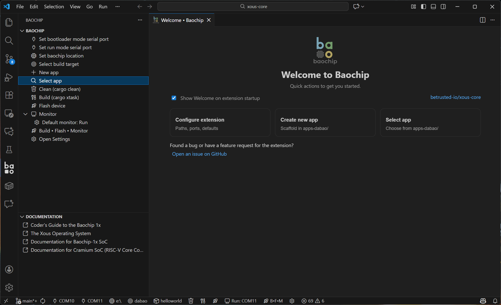

# Baochip VS Code Extension

A VS Code extension for developing applications for Baochip microcontrollers.  
This extension integrates building, flashing, and serial monitoring directly into the editor, providing a streamlined development workflow.

---



---

## Features

### Welcome Page
A simple start screen with:
- Quick setup actions
- App creation and selection
- Links to documentation
- Optional "show on startup" toggle

### Application Workflow
- Create new Baochip applications via tools-bao
- Select existing apps from `xous-core/apps-dabao/`
- Supports multiple apps per build (space-separated)

### Build Workflow
- Select build target (e.g., `dabao`, `baosec`)
- Build target-only or build multiple apps
- Full clean support

### Flash Workflow
- Flash UF2 firmware to Baochip devices
- Auto-detects the UF2 drive when possible
- Allows manual override

### Serial Monitor
- Raw mode (immediate keystroke passthrough)
- Line mode with CRLF normalization
- Auto port re-enumeration (Run Mode ↔ Bootloader Mode)
- Graceful disconnect handling
- Optional local echo

### Combined Build/Flash/Monitor Command
A single command that:
1. Builds the firmware  
2. Flashes via UF2  
3. Opens the serial monitor  

Useful for rapid development cycles.

### Sidebar Integration
Provides:
- Build / flash / monitor controls
- App-related commands
- Documentation links

### Localization
The extension user interface supports:
- German (de)
- Japanese (ja)
- Simplified Chinese (zh-cn)
- Traditional Chinese (zh-tw)

---

## Quickstart

### 1. Install Requirements
- Python 3  
- A local checkout of `xous-core`  
- `tools-bao` (`bao.py`) inside that repository  
- Baochip hardware for flashing and serial monitoring

Clone xous-core:

```sh
git clone https://github.com/betrusted-io/xous-core
```

- Open your xous-core repository in VS Code to begin writing Baochip applications.

## 2. Configuring the extension

- Prompts for paths, serial ports, and flash locations will appear during normal workflows.
- You can additionally configure settings ad-hoc from the commands list, toolbar, or from Settings

## 3. Create or Select an App

Use the Welcome page or the command palette:

    Baochip: Create App
    Baochip: Select App

Applications live inside:

    xous-core/apps-dabao/

## 4. Write code! 

- Write code for your app inside the the apps location you have selected.

## 5. Build, Flash, Monitor

You may use any of the following:

- Individual commands
- The Baochip sidebar
- Or the combined all-in-one command:

    Baochip: Build • Flash • Monitor

