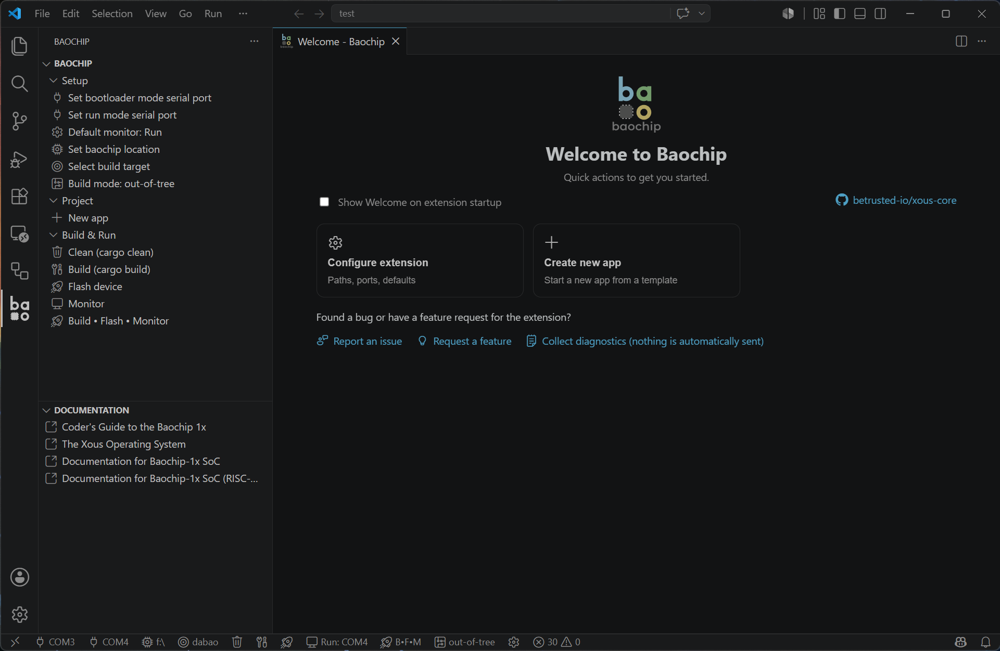

# Baochip VS Code Extension

A VS Code extension for developing applications for Baochip microcontrollers.  
This extension integrates building, flashing, and serial monitoring directly into the editor, providing a streamlined development workflow.

---



---

## Features

### Build Modes
The extension auto-detects your workflow from the open workspace:
- **In-tree** - develop apps inside a local `xous-core` checkout
- **Out-of-tree** - develop standalone apps without a local `xous-core`; kernel files can be downloaded automatically or you can provide your own builds.

### Welcome Page
A simple start screen with:
- Quick setup actions
- App creation and selection
- Links to documentation
- Optional "show on startup" toggle

### Application Workflow
- Create new Baochip applications (scaffolded under `xous-core/apps-dabao/`)
- Select existing apps from `xous-core/apps-dabao/`

### Build Workflow
- Select build target (e.g., `dabao`, `baosec`)
- Full clean support

### Flash Workflow
- Flash UF2 firmware to Baochip devices

### Serial Monitor
- Raw mode (immediate keystroke passthrough)
- Line mode with CRLF normalization
- Run Mode <-> Bootloader Mode option for ports

### Combined Build/Flash/Monitor Command
A single command that:
1. Builds the firmware  
2. Flashes via UF2  
3. Prompts board to boot
4. Opens the serial monitor connected to the board in run mode

Useful for rapid development cycles.

### Sidebar Integration
Provides:
- Build / flash / monitor controls
- App-related commands
- Documentation links

### Localization
The extension user interface supports:
- German (de)
- Japanese (ja)
- Simplified Chinese (zh-cn)
- Traditional Chinese (zh-tw)

---

## Quickstart

### 1. Install Requirements
- Python 3 (optional - if none is found on your system, the extension installs a private copy for you)

### 2. Open your project

**In-tree:** Clone and open `xous-core` in VS Code:
```sh
git clone https://github.com/betrusted-io/xous-core
```
Then, use **Baochip: New App** to add an app to the tree (see step 4).

**Out-of-tree:** Open any folder in VS Code - no `xous-core` required. Use **Baochip: New App** to start from scratch.

### 3. Configuring the extension

- Prompts for paths, serial ports, and flash locations will appear during normal workflows.
- You can additionally configure settings ad-hoc from the commands list, toolbar, or from Settings

### 4. Create or Select an App

Use the Welcome page or the command palette:

    Baochip: New App
    Baochip: Select App

Applications live inside:

    xous-core/apps-dabao/

### 5. Write code!

- Write code for your app inside the apps location you have selected.

### 6. Build, Flash, Monitor

You may use any of the following:

- Individual commands
- The Baochip sidebar
- Or the combined all-in-one command:

    Baochip: Build - Flash - Monitor

---

## Storage and disk space

The extension installs its Python tooling into VS Code's own global storage - not into your project
or onto your system PATH - so it is fully self-contained and is removed when you uninstall the
extension. If a working `uv` is already installed on your machine, the extension reuses it instead of
installing its own.

`Baochip: Reset UV Setup` clears the saved setup and can delete the cached virtual environment (rebuilt
on the next command); `Baochip: Re-run Extension Setup` deletes the private uv, Python, and virtual
environment and reinstalls them from scratch.

Approximate space used under VS Code global storage:

- uv (installed automatically if not already present): ~35 MB
- Python runtime (downloaded only if no system Python is found): ~150 MB
- Python virtual environment and dependencies (pyserial, etc.): ~30 MB

If no suitable Python is found on your system, the extension can download a self-contained Python for
you, which uses roughly an additional 150 MB. Nothing is written outside VS Code's storage.

